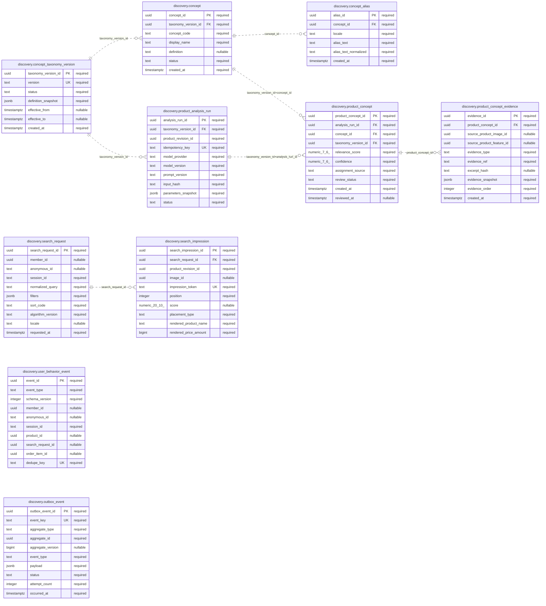

# discovery / discovery — current

주요 키/컬럼 최대10개 표시. 전체 컬럼/제약은 [서비스 데이터 사전](discovery-data-service.md), 영역 밖 FK는 서비스 DBML을 확인합니다.

```mermaid
erDiagram
    direction LR
    discoveryConceptTaxonomyVersion["discovery.concept_taxonomy_version"] {
        uuid taxonomy_version_id PK "required"
        text version UK "required"
        text status "required"
        jsonb definition_snapshot "required"
        timestamptz effective_from "nullable"
        timestamptz effective_to "nullable"
        timestamptz created_at "required"
    }
    discoveryConcept["discovery.concept"] {
        uuid concept_id PK "required"
        uuid taxonomy_version_id FK "required"
        text concept_code "required"
        text display_name "required"
        text definition "nullable"
        text status "required"
        timestamptz created_at "required"
    }
    discoveryConceptAlias["discovery.concept_alias"] {
        uuid alias_id PK "required"
        uuid concept_id FK "required"
        text locale "required"
        text alias_text "required"
        text alias_text_normalized "required"
        timestamptz created_at "required"
    }
    discoveryProductAnalysisRun["discovery.product_analysis_run"] {
        uuid analysis_run_id PK "required"
        uuid taxonomy_version_id FK "required"
        uuid product_revision_id "required"
        text idempotency_key UK "required"
        text model_provider "required"
        text model_version "required"
        text prompt_version "required"
        text input_hash "required"
        jsonb parameters_snapshot "required"
        text status "required"
    }
    discoveryProductConcept["discovery.product_concept"] {
        uuid product_concept_id PK "required"
        uuid analysis_run_id FK "required"
        uuid concept_id FK "required"
        uuid taxonomy_version_id FK "required"
        numeric_7_6_ relevance_score "required"
        numeric_7_6_ confidence "required"
        text assignment_source "required"
        text review_status "required"
        timestamptz created_at "required"
        timestamptz reviewed_at "nullable"
    }
    discoveryProductConceptEvidence["discovery.product_concept_evidence"] {
        uuid evidence_id PK "required"
        uuid product_concept_id FK "required"
        uuid source_product_image_id "nullable"
        uuid source_product_feature_id "nullable"
        text evidence_type "required"
        text evidence_ref "required"
        text excerpt_hash "nullable"
        jsonb evidence_snapshot "required"
        integer evidence_order "required"
        timestamptz created_at "required"
    }
    discoverySearchRequest["discovery.search_request"] {
        uuid search_request_id PK "required"
        uuid member_id "nullable"
        text anonymous_id "nullable"
        text session_id "required"
        text normalized_query "required"
        jsonb filters "required"
        text sort_code "required"
        text algorithm_version "required"
        text locale "nullable"
        timestamptz requested_at "required"
    }
    discoverySearchImpression["discovery.search_impression"] {
        uuid search_impression_id PK "required"
        uuid search_request_id FK "required"
        uuid product_revision_id "required"
        uuid image_id "nullable"
        text impression_token UK "required"
        integer position "required"
        numeric_20_10_ score "nullable"
        text placement_type "required"
        text rendered_product_name "required"
        bigint rendered_price_amount "required"
    }
    discoveryUserBehaviorEvent["discovery.user_behavior_event"] {
        uuid event_id PK "required"
        text event_type "required"
        integer schema_version "required"
        uuid member_id "nullable"
        text anonymous_id "nullable"
        text session_id "required"
        uuid product_id "nullable"
        uuid search_request_id "nullable"
        uuid order_item_id "nullable"
        text dedupe_key UK "required"
    }
    discoveryOutboxEvent["discovery.outbox_event"] {
        uuid outbox_event_id PK "required"
        text event_key UK "required"
        text aggregate_type "required"
        uuid aggregate_id "required"
        bigint aggregate_version "nullable"
        text event_type "required"
        jsonb payload "required"
        text status "required"
        integer attempt_count "required"
        timestamptz occurred_at "required"
    }
    discoveryConceptTaxonomyVersion ||..o{ discoveryConcept : "taxonomy_version_id"
    discoveryConcept ||..o{ discoveryConceptAlias : "concept_id"
    discoveryConceptTaxonomyVersion ||..o{ discoveryProductAnalysisRun : "taxonomy_version_id"
    discoveryProductAnalysisRun ||..o{ discoveryProductConcept : "taxonomy_version_id+analysis_run_id"
    discoveryConcept ||..o{ discoveryProductConcept : "taxonomy_version_id+concept_id"
    discoveryProductConcept ||..o{ discoveryProductConceptEvidence : "product_concept_id"
    discoverySearchRequest ||..o{ discoverySearchImpression : "search_request_id"
```
