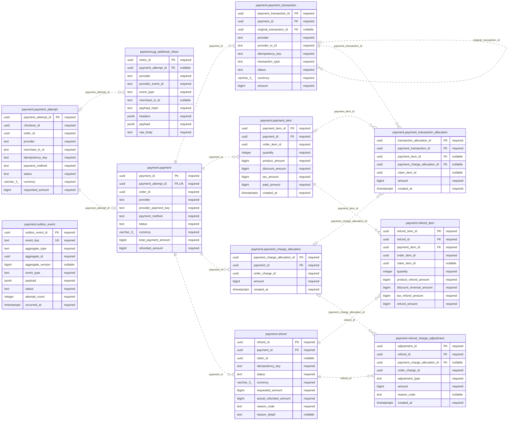

# payment / payment — current

주요 키/컬럼 최대10개 표시. 전체 컬럼/제약은 [서비스 데이터 사전](payment-service.md), 영역 밖 FK는 서비스 DBML을 확인합니다.

```mermaid
erDiagram
    direction LR
    paymentPaymentAttempt["payment.payment_attempt"] {
        uuid payment_attempt_id PK "required"
        uuid checkout_id "required"
        uuid order_id "required"
        text provider "required"
        text merchant_tx_id "required"
        text idempotency_key "required"
        text payment_method "required"
        text status "required"
        varchar_3_ currency "required"
        bigint requested_amount "required"
    }
    paymentPayment["payment.payment"] {
        uuid payment_id PK "required"
        uuid payment_attempt_id FK, UK "required"
        uuid order_id "required"
        text provider "required"
        text provider_payment_key "required"
        text payment_method "required"
        text status "required"
        varchar_3_ currency "required"
        bigint total_payment_amount "required"
        bigint refunded_amount "required"
    }
    paymentPaymentItem["payment.payment_item"] {
        uuid payment_item_id PK "required"
        uuid payment_id FK "required"
        uuid order_item_id "required"
        integer quantity "required"
        bigint product_amount "required"
        bigint discount_amount "required"
        bigint tax_amount "required"
        bigint paid_amount "required"
        timestamptz created_at "required"
    }
    paymentPaymentChargeAllocation["payment.payment_charge_allocation"] {
        uuid payment_charge_allocation_id PK "required"
        uuid payment_id FK "required"
        uuid order_charge_id "required"
        bigint amount "required"
        timestamptz created_at "required"
    }
    paymentPaymentTransaction["payment.payment_transaction"] {
        uuid payment_transaction_id PK "required"
        uuid payment_id FK "required"
        uuid original_transaction_id FK "nullable"
        text provider "required"
        text provider_tx_id "required"
        text idempotency_key "required"
        text transaction_type "required"
        text status "required"
        varchar_3_ currency "required"
        bigint amount "required"
    }
    paymentPaymentTransactionAllocation["payment.payment_transaction_allocation"] {
        uuid transaction_allocation_id PK "required"
        uuid payment_transaction_id FK "required"
        uuid payment_item_id FK "nullable"
        uuid payment_charge_allocation_id FK "nullable"
        uuid claim_item_id "nullable"
        bigint amount "required"
        timestamptz created_at "required"
    }
    paymentRefund["payment.refund"] {
        uuid refund_id PK "required"
        uuid payment_id FK "required"
        uuid claim_id "nullable"
        text idempotency_key "required"
        text status "required"
        varchar_3_ currency "required"
        bigint requested_amount "required"
        bigint actual_refunded_amount "required"
        text reason_code "required"
        text reason_detail "nullable"
    }
    paymentRefundItem["payment.refund_item"] {
        uuid refund_item_id PK "required"
        uuid refund_id FK "required"
        uuid payment_item_id FK "required"
        uuid order_item_id "required"
        uuid claim_item_id "nullable"
        integer quantity "required"
        bigint product_refund_amount "required"
        bigint discount_reversal_amount "required"
        bigint tax_refund_amount "required"
        bigint refund_amount "required"
    }
    paymentRefundChargeAdjustment["payment.refund_charge_adjustment"] {
        uuid adjustment_id PK "required"
        uuid refund_id FK "required"
        uuid payment_charge_allocation_id FK "nullable"
        uuid order_charge_id "required"
        text adjustment_type "required"
        bigint amount "required"
        text reason_code "nullable"
        timestamptz created_at "required"
    }
    paymentPgWebhookInbox["payment.pg_webhook_inbox"] {
        uuid inbox_id PK "required"
        uuid payment_attempt_id FK "nullable"
        text provider "required"
        text provider_event_id "required"
        text event_type "required"
        text merchant_tx_id "nullable"
        text payload_hash "required"
        jsonb headers "required"
        jsonb payload "required"
        text raw_body "required"
    }
    paymentOutboxEvent["payment.outbox_event"] {
        uuid outbox_event_id PK "required"
        text event_key UK "required"
        text aggregate_type "required"
        uuid aggregate_id "required"
        bigint aggregate_version "nullable"
        text event_type "required"
        jsonb payload "required"
        text status "required"
        integer attempt_count "required"
        timestamptz occurred_at "required"
    }
    paymentPayment ||..o{ paymentPaymentTransaction : "payment_id"
    paymentPaymentTransaction |o..o{ paymentPaymentTransaction : "original_transaction_id"
    paymentPaymentAttempt |o..o{ paymentPgWebhookInbox : "payment_attempt_id"
    paymentPaymentAttempt ||..o| paymentPayment : "payment_attempt_id"
    paymentPayment ||..o{ paymentPaymentItem : "payment_id"
    paymentPayment ||..o{ paymentPaymentChargeAllocation : "payment_id"
    paymentPaymentTransaction ||..o{ paymentPaymentTransactionAllocation : "payment_transaction_id"
    paymentPaymentItem |o..o{ paymentPaymentTransactionAllocation : "payment_item_id"
    paymentPaymentChargeAllocation |o..o{ paymentPaymentTransactionAllocation : "payment_charge_allocation_id"
    paymentPayment ||..o{ paymentRefund : "payment_id"
    paymentRefund ||..o{ paymentRefundItem : "refund_id"
    paymentPaymentItem ||..o{ paymentRefundItem : "payment_item_id"
    paymentRefund ||..o{ paymentRefundChargeAdjustment : "refund_id"
    paymentPaymentChargeAllocation |o..o{ paymentRefundChargeAdjustment : "payment_charge_allocation_id"
```
