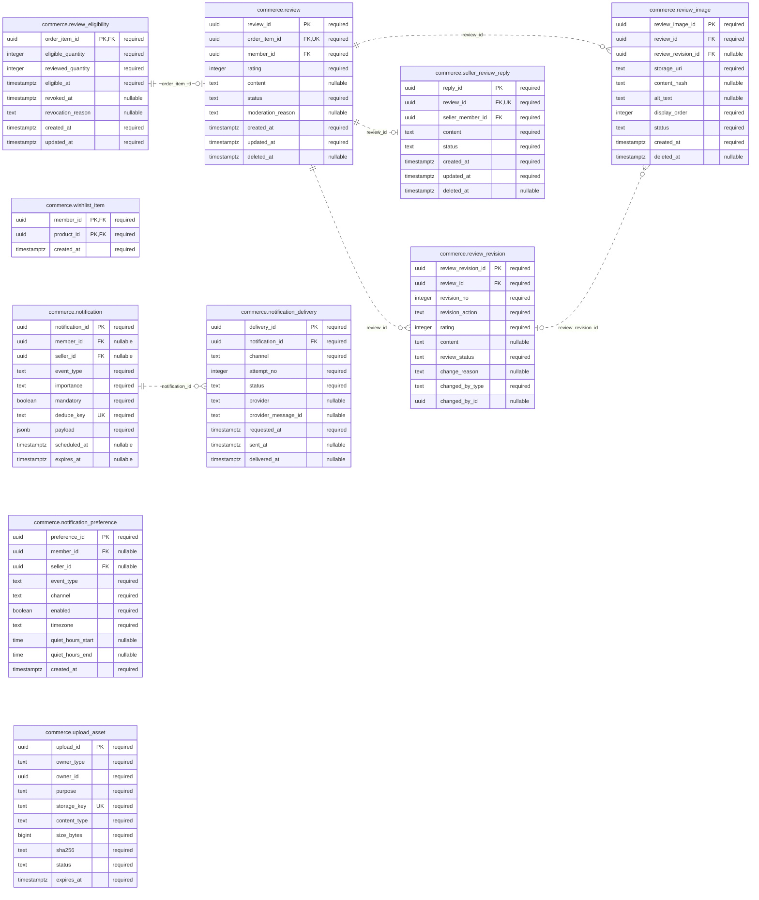

# commerce / 리뷰·알림 — target

주요 키/컬럼 최대10개 표시. 전체 컬럼/제약은 [서비스 데이터 사전](commerce-service.md), 영역 밖 FK는 서비스 DBML을 확인합니다.

```mermaid
erDiagram
    direction LR
    commerceReviewEligibility["commerce.review_eligibility"] {
        uuid order_item_id PK, FK "required"
        integer eligible_quantity "required"
        integer reviewed_quantity "required"
        timestamptz eligible_at "required"
        timestamptz revoked_at "nullable"
        text revocation_reason "nullable"
        timestamptz created_at "required"
        timestamptz updated_at "required"
    }
    commerceReview["commerce.review"] {
        uuid review_id PK "required"
        uuid order_item_id FK, UK "required"
        uuid member_id FK "required"
        integer rating "required"
        text content "nullable"
        text status "required"
        text moderation_reason "nullable"
        timestamptz created_at "required"
        timestamptz updated_at "required"
        timestamptz deleted_at "nullable"
    }
    commerceReviewRevision["commerce.review_revision"] {
        uuid review_revision_id PK "required"
        uuid review_id FK "required"
        integer revision_no "required"
        text revision_action "required"
        integer rating "required"
        text content "nullable"
        text review_status "required"
        text change_reason "nullable"
        text changed_by_type "required"
        uuid changed_by_id "nullable"
    }
    commerceReviewImage["commerce.review_image"] {
        uuid review_image_id PK "required"
        uuid review_id FK "required"
        uuid review_revision_id FK "nullable"
        text storage_uri "required"
        text content_hash "nullable"
        text alt_text "nullable"
        integer display_order "required"
        text status "required"
        timestamptz created_at "required"
        timestamptz deleted_at "nullable"
    }
    commerceSellerReviewReply["commerce.seller_review_reply"] {
        uuid reply_id PK "required"
        uuid review_id FK, UK "required"
        uuid seller_member_id FK "required"
        text content "required"
        text status "required"
        timestamptz created_at "required"
        timestamptz updated_at "required"
        timestamptz deleted_at "nullable"
    }
    commerceWishlistItem["commerce.wishlist_item"] {
        uuid member_id PK, FK "required"
        uuid product_id PK, FK "required"
        timestamptz created_at "required"
    }
    commerceNotification["commerce.notification"] {
        uuid notification_id PK "required"
        uuid member_id FK "nullable"
        uuid seller_id FK "nullable"
        text event_type "required"
        text importance "required"
        boolean mandatory "required"
        text dedupe_key UK "required"
        jsonb payload "required"
        timestamptz scheduled_at "nullable"
        timestamptz expires_at "nullable"
    }
    commerceNotificationPreference["commerce.notification_preference"] {
        uuid preference_id PK "required"
        uuid member_id FK "nullable"
        uuid seller_id FK "nullable"
        text event_type "required"
        text channel "required"
        boolean enabled "required"
        text timezone "required"
        time quiet_hours_start "nullable"
        time quiet_hours_end "nullable"
        timestamptz created_at "required"
    }
    commerceNotificationDelivery["commerce.notification_delivery"] {
        uuid delivery_id PK "required"
        uuid notification_id FK "required"
        text channel "required"
        integer attempt_no "required"
        text status "required"
        text provider "nullable"
        text provider_message_id "nullable"
        timestamptz requested_at "required"
        timestamptz sent_at "nullable"
        timestamptz delivered_at "nullable"
    }
    commerceUploadAsset["commerce.upload_asset"] {
        uuid upload_id PK "required"
        text owner_type "required"
        uuid owner_id "required"
        text purpose "required"
        text storage_key UK "required"
        text content_type "required"
        bigint size_bytes "required"
        text sha256 "required"
        text status "required"
        timestamptz expires_at "required"
    }
    commerceReviewEligibility ||..o| commerceReview : "order_item_id"
    commerceReview ||..o{ commerceReviewRevision : "review_id"
    commerceReview ||..o{ commerceReviewImage : "review_id"
    commerceReviewRevision |o..o{ commerceReviewImage : "review_revision_id"
    commerceReview ||..o| commerceSellerReviewReply : "review_id"
    commerceNotification ||..o{ commerceNotificationDelivery : "notification_id"
```
