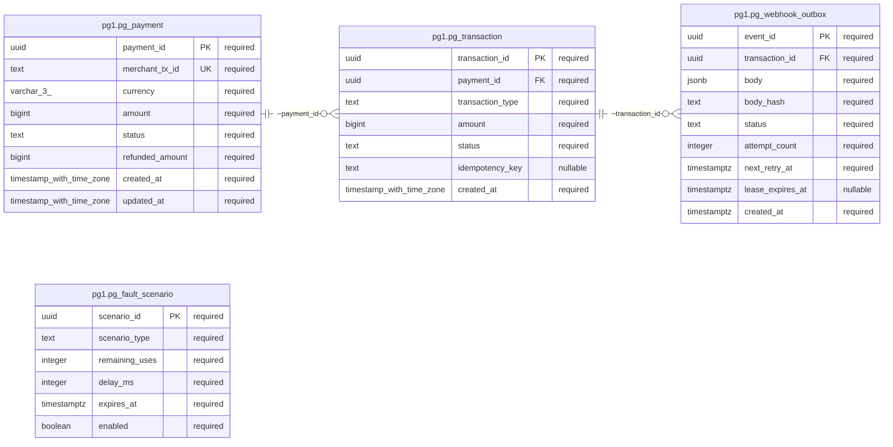

# pg1 / pg1 — target

주요 키/컬럼 최대10개 표시. 전체 컬럼/제약은 [서비스 데이터 사전](pg-kakao-simulator.md), 영역 밖 FK는 서비스 DBML을 확인합니다.

```mermaid
erDiagram
    direction LR
    pg1PgPayment["pg1.pg_payment"] {
        uuid payment_id PK "required"
        text merchant_tx_id UK "required"
        varchar_3_ currency "required"
        bigint amount "required"
        text status "required"
        bigint refunded_amount "required"
        timestamp_with_time_zone created_at "required"
        timestamp_with_time_zone updated_at "required"
    }
    pg1PgTransaction["pg1.pg_transaction"] {
        uuid transaction_id PK "required"
        uuid payment_id FK "required"
        text transaction_type "required"
        bigint amount "required"
        text status "required"
        text idempotency_key "nullable"
        timestamp_with_time_zone created_at "required"
    }
    pg1PgWebhookOutbox["pg1.pg_webhook_outbox"] {
        uuid event_id PK "required"
        uuid transaction_id FK "required"
        jsonb body "required"
        text body_hash "required"
        text status "required"
        integer attempt_count "required"
        timestamptz next_retry_at "required"
        timestamptz lease_expires_at "nullable"
        timestamptz created_at "required"
    }
    pg1PgFaultScenario["pg1.pg_fault_scenario"] {
        uuid scenario_id PK "required"
        text scenario_type "required"
        integer remaining_uses "required"
        integer delay_ms "required"
        timestamptz expires_at "required"
        boolean enabled "required"
    }
    pg1PgPayment ||..o{ pg1PgTransaction : "payment_id"
    pg1PgTransaction ||..o{ pg1PgWebhookOutbox : "transaction_id"
```
