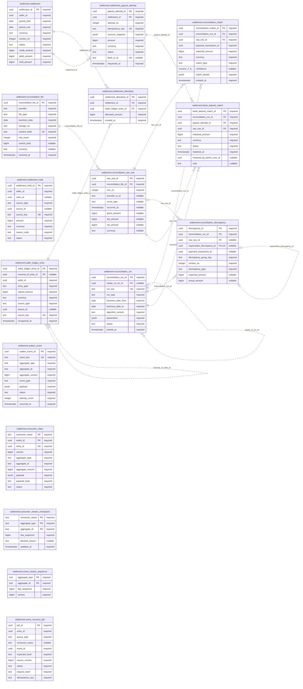

# settlement / settlement 1 — target

주요 키/컬럼 최대10개 표시. 전체 컬럼/제약은 [서비스 데이터 사전](settlement-service.md), 영역 밖 FK는 서비스 DBML을 확인합니다.

```mermaid
erDiagram
    direction LR
    settlementSellerLedgerEntry["settlement.seller_ledger_entry"] {
        uuid seller_ledger_entry_id PK "required"
        uuid reversal_of_entry_id FK "nullable"
        uuid seller_id "required"
        text entry_type "required"
        bigint signed_amount "required"
        text currency "required"
        text source_type "required"
        uuid source_id "nullable"
        text source_key UK "required"
        timestamptz recognized_at "required"
    }
    settlementSettlement["settlement.settlement"] {
        uuid settlement_id PK "required"
        uuid seller_id "required"
        date period_start "required"
        date period_end "required"
        text currency "required"
        integer version_no "required"
        text status "required"
        bigint credit_amount "required"
        bigint debit_amount "required"
        bigint hold_amount "required"
    }
    settlementSettlementAllocation["settlement.settlement_allocation"] {
        uuid settlement_allocation_id PK "required"
        uuid settlement_id FK "required"
        uuid seller_ledger_entry_id FK "required"
        bigint allocated_amount "required"
        timestamptz created_at "required"
    }
    settlementSettlementHold["settlement.settlement_hold"] {
        uuid settlement_hold_id PK "required"
        uuid seller_id "required"
        uuid claim_id "nullable"
        text source_type "required"
        uuid source_id "nullable"
        text source_key UK "required"
        bigint amount "required"
        text currency "required"
        text reason_code "required"
        text status "required"
    }
    settlementSettlementPayoutAttempt["settlement.settlement_payout_attempt"] {
        uuid payout_attempt_id PK "required"
        uuid settlement_id FK "required"
        integer attempt_no "required"
        text idempotency_key UK "required"
        jsonb account_snapshot "required"
        bigint amount "required"
        text currency "required"
        text status "required"
        text bank_tx_id UK "nullable"
        timestamptz requested_at "required"
    }
    settlementReconciliationFile["settlement.reconciliation_file"] {
        uuid reconciliation_file_id PK "required"
        text provider "required"
        text file_type "required"
        date business_date "required"
        text storage_uri "required"
        text content_hash UK "required"
        integer row_count "required"
        bigint control_total "nullable"
        text currency "nullable"
        timestamptz received_at "required"
    }
    settlementReconciliationRawRow["settlement.reconciliation_raw_row"] {
        uuid raw_row_id PK "required"
        uuid reconciliation_file_id FK "required"
        integer row_no "required"
        text provider_tx_id "nullable"
        text event_type "nullable"
        timestamptz occurred_at "nullable"
        bigint gross_amount "nullable"
        bigint fee_amount "nullable"
        bigint net_amount "nullable"
        text currency "nullable"
    }
    settlementReconciliationRun["settlement.reconciliation_run"] {
        uuid reconciliation_run_id PK "required"
        uuid replay_of_run_id FK "nullable"
        text run_key UK "required"
        text run_type "required"
        date business_date_from "required"
        date business_date_to "required"
        text algorithm_version "required"
        jsonb parameters "required"
        text status "required"
        timestamptz started_at "required"
    }
    settlementReconciliationMatch["settlement.reconciliation_match"] {
        uuid reconciliation_match_id PK "required"
        uuid reconciliation_run_id FK "required"
        uuid raw_row_id FK "required"
        uuid payment_transaction_id "required"
        bigint matched_amount "required"
        text currency "required"
        text match_type "required"
        numeric_7_6_ confidence "nullable"
        jsonb match_details "required"
        timestamptz created_at "required"
    }
    settlementReconciliationDiscrepancy["settlement.reconciliation_discrepancy"] {
        uuid discrepancy_id PK "required"
        uuid reconciliation_run_id FK "required"
        uuid raw_row_id FK "nullable"
        uuid supersedes_discrepancy_id FK, UK "nullable"
        uuid payment_transaction_id "nullable"
        text discrepancy_group_key "required"
        integer version_no "required"
        text discrepancy_type "required"
        bigint expected_amount "nullable"
        bigint actual_amount "nullable"
    }
    settlementBankDepositMatch["settlement.bank_deposit_match"] {
        uuid bank_deposit_match_id PK "required"
        uuid reconciliation_run_id FK "required"
        uuid payout_attempt_id FK "required"
        uuid raw_row_id FK "required"
        bigint matched_amount "required"
        text currency "required"
        text status "required"
        timestamptz matched_at "required"
        uuid matched_by_admin_user_id "nullable"
        text note "nullable"
    }
    settlementOutboxEvent["settlement.outbox_event"] {
        uuid outbox_event_id PK "required"
        text event_key UK "required"
        text aggregate_type "required"
        text aggregate_id "required"
        bigint aggregate_version "required"
        text event_type "required"
        jsonb payload "required"
        text status "required"
        integer attempt_count "required"
        timestamptz occurred_at "required"
    }
    settlementConsumerInbox["settlement.consumer_inbox"] {
        text consumer_name PK "required"
        uuid event_id PK "required"
        uuid entry_id UK "required"
        bigint version "required"
        text aggregate_type "required"
        text aggregate_id "required"
        bigint aggregate_version "required"
        jsonb payload "required"
        text payload_hash "required"
        text status "required"
    }
    settlementConsumerStreamCheckpoint["settlement.consumer_stream_checkpoint"] {
        text consumer_name PK "required"
        text aggregate_type PK "required"
        text aggregate_id PK "required"
        bigint last_sequence "required"
        text blocked_reason "nullable"
        timestamptz updated_at "required"
    }
    settlementEventStreamSequence["settlement.event_stream_sequence"] {
        text aggregate_type PK "required"
        text aggregate_id PK "required"
        bigint last_sequence "required"
        bigint version "required"
    }
    settlementEventRecoveryJob["settlement.event_recovery_job"] {
        uuid job_id PK "required"
        uuid entry_id "required"
        text queue_type "required"
        text consumer_name "nullable"
        uuid event_id "required"
        text expected_hash "required"
        bigint source_version "required"
        text status "required"
        text request_hash "required"
        text idempotency_key "required"
    }
    settlementSettlement ||..o{ settlementSettlementAllocation : "settlement_id"
    settlementSellerLedgerEntry ||..o{ settlementSettlementAllocation : "seller_ledger_entry_id"
    settlementSettlement ||..o{ settlementSettlementPayoutAttempt : "settlement_id"
    settlementReconciliationFile ||..o{ settlementReconciliationRawRow : "reconciliation_file_id"
    settlementSellerLedgerEntry |o..o{ settlementSellerLedgerEntry : "reversal_of_entry_id"
    settlementReconciliationRun |o..o{ settlementReconciliationRun : "replay_of_run_id"
    settlementReconciliationRun ||..o{ settlementReconciliationMatch : "reconciliation_run_id"
    settlementReconciliationRawRow ||..o{ settlementReconciliationMatch : "raw_row_id"
    settlementReconciliationRun ||..o{ settlementReconciliationDiscrepancy : "reconciliation_run_id"
    settlementReconciliationRawRow |o..o{ settlementReconciliationDiscrepancy : "raw_row_id"
    settlementReconciliationDiscrepancy |o..o| settlementReconciliationDiscrepancy : "supersedes_discrepancy_id"
    settlementReconciliationRun ||..o{ settlementBankDepositMatch : "reconciliation_run_id"
    settlementSettlementPayoutAttempt ||..o{ settlementBankDepositMatch : "payout_attempt_id"
    settlementReconciliationRawRow ||..o{ settlementBankDepositMatch : "raw_row_id"
```
